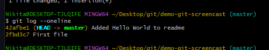
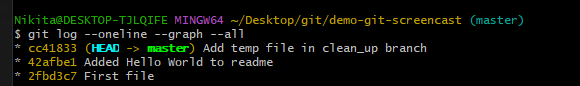
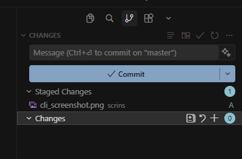
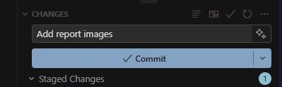
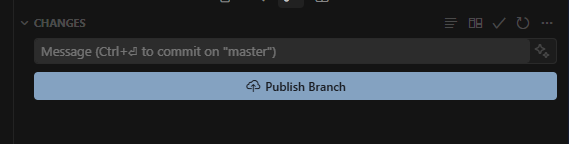
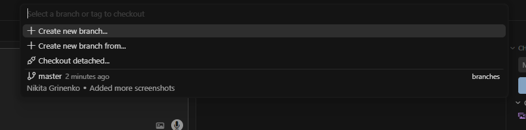

# Работа с Git

**Дисциплина:** Программирование  
**Выполнил:** Гриненко Никита Дмитриевич  
**Тема Moodle:** Общее — «Работа с Git»

---

## 1. Работа в командной строке (CLI)

В ходе выполнения задания были воспроизведены действия из обучающего скринкаста. В связи с использованием ОС Windows, команды выполнялись в терминале **Git Bash**, что позволило корректно использовать Unix-подобные команды.

**Пошаговое выполнение базовых операций (согласно видео):**

1. **Базовая настройка и инициализация:**  
   Перед началом работы были заданы глобальные параметры пользователя:
   ```bash
   git config --global user.name "Nikita Grinenko"
   git config --global user.email "nikitagrinenko2003@gmail.com"
   ```
   Был создан новый каталог и инициализирован пустой репозиторий командой `git init`.

2. **Жизненный цикл файлов и фиксация изменений:**
   * С помощью команды `touch readme.txt` был создан файл. Проверка `git status` показала его как untracked.
   * Файл был добавлен в индекс (`git add readme.txt`) и зафиксирован в истории (`git commit -m "First file"`).
   * После изменения содержимого файла была проверена разница с помощью команды `git diff`, после чего изменения были проиндексированы и сохранены во второй коммит.

   

   *Рис 1. Просмотр линейной истории коммитов (git log --oneline)*

3. **Работа с ветками (Branching & Merging):**
   * Для безопасной работы над новым функционалом была создана и выбрана новая ветка: `git checkout -b clean_up`.
   * В новой ветке был создан временный файл и зафиксирован новый коммит.
   * После завершения работы вернулись в главную ветку (`git checkout master`) и выполнили слияние: `git merge clean_up`.
   * Ветка `clean_up` удалена: `git branch -d clean_up`.

   

   *Рис 2. Дерево коммитов после слияния веток (git log --graph --all)*

4. **Синхронизация с удаленным репозиторием:**  
   Изучены команды для связи локального репозитория с удаленным сервером (GitHub): добавление ссылки `git remote add origin <URL>`, отправка изменений `git push -u origin master` и получение обновлений `git pull origin master`.

---

## 2. Исследование GUI-клиента для работы с Git

**Выбранный инструмент:** Вариант 4. Встроенные средства IDE (VS Code).  
**Причина выбора:** Бесшовная интеграция редактора кода и системы контроля версий, что ускоряет процесс разработки без необходимости постоянно переключаться в терминал или сторонние приложения.

### Демонстрация выполнения основных операций в VS Code:

1. **Индексация файлов (git add):**  
   На вкладке «Source Control» отображаются измененные файлы. Нажатие на «+» рядом с файлом переносит его в «Staged Changes», подготавливая к фиксации.

   

2. **Создание фиксации (git commit):**  
   Осуществляется простым вводом сообщения в поле «Message» и нажатием кнопки «Commit». Это полностью заменяет необходимость писать консольную команду с флагом `-m`.

   

3. **Синхронизация с удаленным репозиторием (git push / pull):**  
   Кнопка «Publish Branch» (или «Sync Changes» для уже связанных веток) позволяет выполнить отправку данных (push) и стягивание изменений (pull) в удаленный репозиторий в один клик.

   

4. **Работа с ветками (git branch / checkout):**  
   В панели управления (левый нижний угол) отображается текущая ветка. Клик по ней вызывает меню быстрого создания новых веток («Create new branch...») или переключения между существующими.

   

   *Рис 3. Меню управления ветками (создание и переключение) в VS Code*

---

## Вывод

Задание успешно выполнено. Были закреплены навыки управления версиями через интерфейс командной строки (Git Bash), полностью воспроизведен рабочий цикл из скринкаста (создание коммитов, просмотр истории, ветвление и слияние). Также были исследованы возможности встроенного GUI-клиента VS Code.

Графический интерфейс значительно упрощает рутинные задачи (индексация файлов, написание коммитов, переключение веток) и делает процесс более наглядным, однако уверенное владение консольными командами необходимо для разрешения нестандартных ситуаций и глубокого понимания логики работы Git.
