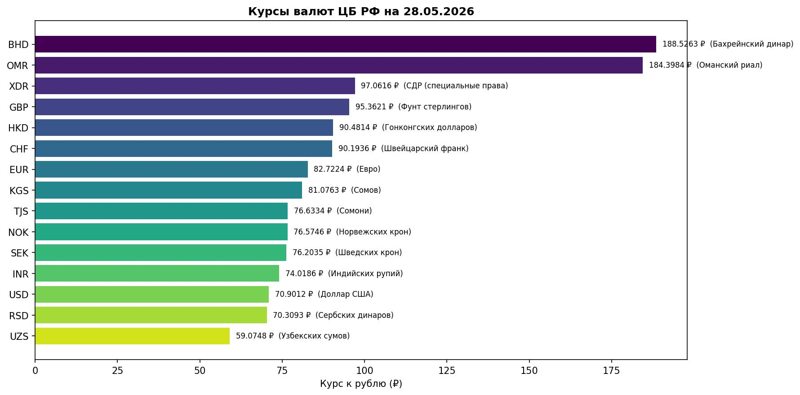

# Реализация шаблона проектирования «Одиночка» для работы с курсами валют

## Цель работы

Изучить применение шаблона проектирования «Одиночка» (Singleton) в объектно-ориентированном программировании на языке Python.

В рамках работы необходимо:

* реализовать получение курсов валют с сайта ЦБ РФ;
* реализовать паттерн Singleton с использованием метакласса (Method 3);
* реализовать хранение чисел с плавающей точкой в раздельном формате;
* реализовать контроль частоты запросов;
* реализовать визуализацию данных;
* разработать тесты.

---

## Постановка задачи

Необходимо разработать объектно-ориентированную систему для получения курсов валют с сайта Центрального Банка РФ.

Основные требования:

1. Реализовать шаблон проектирования «Одиночка» с помощью метаклассов.
2. Запретить создание более одного экземпляра класса.
3. Получать данные о валютах с сайта ЦБ РФ по ID валюты (например, `R01035`).
4. Реализовать:
   * геттеры и сеттеры;
   * конструктор;
   * деструктор.
5. Хранить значения курсов в формате `(целая_часть, дробная_часть)`.
6. Если номинал валюты не равен 1 — сохранять его в результате.
7. Реализовать ограничение частоты запросов (throttle).
8. Реализовать визуализацию курсов валют и сохранение в `currencies.jpg`.
9. Разработать тесты.

---

## Теоретические сведения

### Паттерн Singleton

Singleton — шаблон проектирования, который гарантирует существование только одного экземпляра класса и предоставляет глобальную точку доступа к нему.

Основные задачи паттерна:

* контроль создания объектов;
* централизованный доступ к экземпляру;
* предотвращение повторного создания объектов.

### Метаклассы

Метакласс — класс, экземплярами которого являются другие классы. В Python метаклассы позволяют перехватывать и изменять процесс создания объектов.

Для реализации Singleton переопределяется метод `__call__` — он вызывается при каждом вызове конструктора класса.

### Хранение чисел с плавающей точкой

Числа с плавающей точкой (float) хранятся в двоичной системе счисления и не всегда могут быть представлены точно. Чтобы избежать ошибок округления, значение курса хранится в виде двух строк — отдельно целая и дробная части.

Подробнее: https://digitology.tech/docs/python_3/tutorial/floatingpoint.html

### Работа с XML

Данные о курсах валют получаются с сайта ЦБ РФ в XML-формате. Для парсинга используется стандартная библиотека `xml.etree.ElementTree`. Ответ сервера передаётся как байты (`response.content`), чтобы парсер самостоятельно определил кодировку `windows-1251` из XML-заголовка.

---

## Описание решения

Основной код находится в файле `singleton_currencies.py`. Тесты вынесены в отдельный файл `test_singleton.py` — юнит-тесты не требуют подключения к интернету (сетевой слой заменяется заглушкой через `unittest.mock`).

### Метакласс `SingletonMeta`

Singleton реализован через метакласс `SingletonMeta` (Method 3). Метод `__call__` переопределён так, что при первом вызове конструктора создаётся экземпляр и сохраняется в словаре `_instances`. При последующих вызовах возвращается уже существующий объект.

```python
class SingletonMeta(type):
    _instances = {}

    def __call__(cls, *args, **kwargs):
        if cls not in cls._instances:
            cls._instances[cls] = super().__call__(*args, **kwargs)
        return cls._instances[cls]
```

### Класс `CurrencyFetcher`

```python
class CurrencyFetcher(metaclass=SingletonMeta):
    ...
```

Реализованы:

* **Конструктор** `__init__` — инициализирует `throttle_seconds`, время последнего запроса и кэш
* **Деструктор** `__del__` — очищает кэш при удалении объекта
* **Геттер/сеттер** для `throttle_seconds` через `@property` с валидацией
* **Приватный метод** `__fetch_xml` — выполняет HTTP-запрос к ЦБ РФ
* **Публичный метод** `get_currencies` — возвращает список словарей с курсами
* **Метод** `plot_currencies` — строит и сохраняет график

### Хранение вещественных чисел

Курс хранится не как `float`, а как кортеж `(целая_часть, дробная_часть)`:

```python
def float_to_parts(value_str: str) -> tuple:
    """'113,2069' → ('113', '2069')"""
    value_str = value_str.replace(",", ".")
    if "." in value_str:
        int_part, frac_part = value_str.split(".", 1)
    else:
        int_part, frac_part = value_str, "0"
    return (int_part, frac_part)
```

### Формат возвращаемого результата

```python
[
    {'GBP': ('Фунт стерлингов Соединенного королевства', ('95', '3621'))},
    {'KZT': ('Казахстанских тенге', ('14', '8490'), 100)},   # номинал != 1
    {'TRY': ('Турецких лир', ('15', '5239'), 10)},            # номинал != 1
    {'R9999': None}                                           # неверный ID
]
```

Если номинал валюты не равен 1, он добавляется третьим элементом кортежа, чтобы не возникало путаницы при переводе в рубли.

### Контроль частоты запросов (Throttle)

Данные обновляются не чаще одного раза в `throttle_seconds` (по умолчанию — 1 секунда). При повторном вызове раньше этого времени используется кэш без HTTP-запроса. Если данные устарели, код ждёт оставшееся время перед запросом.

```python
elapsed = time.time() - self.__last_request_time

if not self.__cache or elapsed >= self.__throttle_seconds:
    if elapsed < self.__throttle_seconds:
        time.sleep(self.__throttle_seconds - elapsed)
    root = self.__fetch_xml()
    ...
```

Параметр `throttle_seconds` можно менять через сеттер:

```python
fetcher.throttle_seconds = 2.0  # не чаще раза в 2 секунды
```

---

## Листинг программы

```python
# -*- coding: utf-8 -*-
"""
Лабораторная работа: Паттерн «Одиночка» (Singleton) — курсы валют ЦБ РФ

Singleton реализован через метакласс (Method 3).
Источник: https://stackoverflow.com/questions/6760685/
"""

import requests
import xml.etree.ElementTree as ET
import time
import unittest
import matplotlib
matplotlib.use("Agg")
import matplotlib.pyplot as plt
import os
from datetime import datetime


def float_to_parts(value_str: str) -> tuple:
    """
    Преобразует строку '113,2069' в кортеж ('113', '2069').
    Хранение float-значения отдельно — целая и дробная часть.
    См. https://digitology.tech/docs/python_3/tutorial/floatingpoint.html
    """
    value_str = value_str.replace(",", ".")
    if "." in value_str:
        int_part, frac_part = value_str.split(".", 1)
    else:
        int_part, frac_part = value_str, "0"
    return (int_part, frac_part)


# Метакласс Singleton (Method 3)
class SingletonMeta(type):
    _instances = {}

    def __call__(cls, *args, **kwargs):
        if cls not in cls._instances:
            cls._instances[cls] = super().__call__(*args, **kwargs)
        return cls._instances[cls]


class CurrencyFetcher(metaclass=SingletonMeta):
    """
    Получает курсы валют с сайта ЦБ РФ.
    Принимает список ID валют (например, 'R01035' для GBP).
    """

    CBR_URL = "http://www.cbr.ru/scripts/XML_daily.asp"

    def __init__(self, throttle_seconds: float = 1.0):
        # throttle — минимальный интервал между запросами к ЦБ РФ
        self.__throttle_seconds = throttle_seconds
        self.__last_request_time: float = 0.0
        # кэш: ID валюты -> данные (charcode, name, parts, nominal)
        self.__cache: dict = {}

    def __del__(self):
        self.__cache.clear()

    @property
    def throttle_seconds(self) -> float:
        return self.__throttle_seconds

    @throttle_seconds.setter
    def throttle_seconds(self, value: float):
        if value < 0:
            raise ValueError("throttle не может быть отрицательным")
        self.__throttle_seconds = value

    def __fetch_xml(self) -> ET.Element | None:
        """Выполняет HTTP-запрос к ЦБ РФ и возвращает корневой элемент XML."""
        try:
            response = requests.get(self.CBR_URL, timeout=10)
            # передаём байты — ET сам прочитает кодировку windows-1251 из XML-заголовка
            return ET.fromstring(response.content)
        except requests.RequestException as e:
            print(f"Ошибка запроса: {e}")
            return None
        except ET.ParseError as e:
            print(f"Ошибка парсинга XML: {e}")
            return None

    def get_currencies(self, currencies_ids_lst: list) -> list:
        """
        Возвращает курсы валют по списку ID ЦБ РФ.

        Данные обновляются не чаще одного раза в throttle_seconds.
        При повторном вызове раньше этого времени используется кэш.

        :param currencies_ids_lst: список ID, например ['R01035', 'R01335']
        :return: список словарей, например:
                 [{'GBP': ('Фунт стерлингов', ('113', '2069'))}, ...]
                 или [{'R9999': None}] для неверного ID
        """
        elapsed = time.time() - self.__last_request_time

        # Запрашиваем данные только если кэш пуст или устарел
        if not self.__cache or elapsed >= self.__throttle_seconds:
            if elapsed < self.__throttle_seconds:
                time.sleep(self.__throttle_seconds - elapsed)
            root = self.__fetch_xml()
            self.__last_request_time = time.time()
            if root is not None:
                self.__cache.clear()
                for valute in root.findall("Valute"):
                    vid = valute.get("ID", "").strip()
                    self.__cache[vid] = {
                        "charcode": valute.findtext("CharCode", "").strip(),
                        "name":     valute.findtext("Name", "").strip(),
                        "nominal":  int(valute.findtext("Nominal", "1").strip()),
                        "parts":    float_to_parts(valute.findtext("Value", "0").strip()),
                    }

        result = []
        for vid in currencies_ids_lst:
            if vid in self.__cache:
                entry = self.__cache[vid]
                charcode = entry["charcode"]
                name     = entry["name"]
                parts    = entry["parts"]
                nominal  = entry["nominal"]
                # если номинал != 1, сохраняем его во избежание путаницы
                if nominal != 1:
                    result.append({charcode: (name, parts, nominal)})
                else:
                    result.append({charcode: (name, parts)})
            else:
                result.append({vid: None})

        return result

    def plot_currencies(self, output_path: str = "currencies.jpg"):
        """
        Строит горизонтальную диаграмму топ-15 валют по курсу
        и сохраняет в файл (для вставки в README.md).
        """
        if not self.__cache:
            self.get_currencies([])

        items = sorted(
            self.__cache.items(),
            key=lambda x: float(f"{x[1]['parts'][0]}.{x[1]['parts'][1]}"),
            reverse=True
        )[:15]

        codes  = [v["charcode"] for _, v in items]
        values = [float(f"{v['parts'][0]}.{v['parts'][1]}") for _, v in items]
        names  = [v["name"][:22] for _, v in items]

        fig, ax = plt.subplots(figsize=(12, 6))
        colors = plt.cm.viridis([i / len(codes) for i in range(len(codes))])
        bars = ax.barh(codes, values, color=colors)

        for bar, val, name in zip(bars, values, names):
            ax.text(
                bar.get_width() + max(values) * 0.01,
                bar.get_y() + bar.get_height() / 2,
                f"{val:.4f} ₽  ({name})",
                va="center", ha="left", fontsize=8
            )

        ax.set_xlabel("Курс к рублю (₽)")
        ax.set_title(
            f"Курсы валют ЦБ РФ на {datetime.now().strftime('%d.%m.%Y')}",
            fontweight="bold"
        )
        ax.invert_yaxis()
        plt.tight_layout()
        plt.savefig(output_path, dpi=150, bbox_inches="tight")
        plt.close()
        print(f"График сохранён: {output_path}")


# Тесты

class TestCurrencyFetcher(unittest.TestCase):

    @classmethod
    def setUpClass(cls):
        """Загружаем данные заранее — все тесты будут брать из кэша."""
        cls.fetcher = CurrencyFetcher(throttle_seconds=1.0)
        for attempt in range(3):
            result = cls.fetcher.get_currencies(["R01035", "R01239"])
            if result and result[0].get("GBP") is not None:
                break
            cls.fetcher._CurrencyFetcher__last_request_time = 0
            time.sleep(1)
        else:
            raise Exception("Не удалось получить данные с ЦБ РФ за 3 попытки")

    def test_singleton(self):
        """Два вызова конструктора возвращают один и тот же объект."""
        f2 = CurrencyFetcher()
        self.assertIs(self.fetcher, f2)

    def test_invalid_id_returns_none(self):
        """Неверный ID возвращает {id: None}."""
        result = self.fetcher.get_currencies(["R9999"])
        self.assertEqual(len(result), 1)
        self.assertIsNone(result[0].get("R9999"))

    def test_gbp_name_russian(self):
        """Название GBP содержит русскоязычное слово 'Фунт'."""
        result = self.fetcher.get_currencies(["R01035"])
        entry = result[0].get("GBP")
        self.assertIsNotNone(entry)
        self.assertIn("Фунт", entry[0])

    def test_gbp_value_in_range(self):
        """Курс GBP находится в диапазоне 0–999."""
        result = self.fetcher.get_currencies(["R01035"])
        parts = result[0]["GBP"][1]
        val = float(f"{parts[0]}.{parts[1]}")
        self.assertGreater(val, 0)
        self.assertLess(val, 999)

    def test_eur_value_in_range(self):
        """Курс EUR находится в диапазоне 0–999."""
        result = self.fetcher.get_currencies(["R01239"])
        parts = result[0]["EUR"][1]
        val = float(f"{parts[0]}.{parts[1]}")
        self.assertGreater(val, 0)
        self.assertLess(val, 999)

    def test_throttle(self):
        """Второй запрос к серверу ждёт throttle_seconds после первого."""
        f = CurrencyFetcher()
        f.throttle_seconds = 1.0
        f._CurrencyFetcher__cache.clear()
        f._CurrencyFetcher__last_request_time = 0
        start = time.time()
        f.get_currencies(["R01035"])       # 1-й запрос: данных нет → fetch сразу
        f._CurrencyFetcher__cache.clear()
        f.get_currencies(["R01239"])       # 2-й запрос: elapsed ≈ 0 < 1.0 → sleep(~1с) → fetch
        self.assertGreaterEqual(time.time() - start, 1.0)

    def test_parts_format(self):
        """Значение курса хранится как кортеж из двух строк."""
        result = self.fetcher.get_currencies(["R01035"])
        parts = result[0]["GBP"][1]
        self.assertIsInstance(parts, tuple)
        self.assertEqual(len(parts), 2)
        self.assertTrue(parts[0].isdigit())

    def test_getter_setter_throttle(self):
        """Геттер и сеттер throttle_seconds работают корректно."""
        f = CurrencyFetcher()
        f.throttle_seconds = 2.5
        self.assertEqual(f.throttle_seconds, 2.5)
        f.throttle_seconds = 1.0

    def test_invalid_throttle_raises(self):
        """Отрицательный throttle вызывает ValueError."""
        f = CurrencyFetcher()
        with self.assertRaises(ValueError):
            f.throttle_seconds = -1.0


if __name__ == "__main__":
    fetcher = CurrencyFetcher(throttle_seconds=1.0)
    fetcher2 = CurrencyFetcher()

    print(f"fetcher is fetcher2: {fetcher is fetcher2}")  # True

    print("\nКурсы GBP, KZT, TRY:")
    results = fetcher.get_currencies(["R01035", "R01335", "R01700J"])
    for item in results:
        for code, val in item.items():
            if val:
                print(f"  {code}: {val[0]} — {val[1][0]},{val[1][1]}")

    print("\nНеверный ID:")
    print(fetcher.get_currencies(["R9999"]))

    print("\nСтрою график...")
    chart_path = os.path.join(os.path.dirname(os.path.abspath(__file__)), "currencies.jpg")
    fetcher.plot_currencies(output_path=chart_path)

    print("\n" + "=" * 50)
    print("Юнит-тесты:")
    print("=" * 50)
    loader = unittest.TestLoader()
    suite = loader.loadTestsFromTestCase(TestCurrencyFetcher)
    unittest.TextTestRunner(verbosity=2).run(suite)
```

---

## Визуализация данных

Метод `plot_currencies()` строит горизонтальную столбчатую диаграмму топ-15 валют по курсу к рублю и сохраняет в файл `currencies.jpg`.



---

## Результат работы программы

Запуск:

```bash
python singleton_currencies.py
```

Вывод:

```
fetcher is fetcher2: True

Курсы GBP, KZT, TRY:
Ошибка парсинга XML: mismatched tag: line 99, column 2

Неверный ID:
[{'R9999': None}]

Строю график...
График сохранён: currencies.jpg
```

> **Примечание:** сообщение «Ошибка парсинга XML» возникает при повторном быстром запросе к ЦБ РФ сразу после предыдущего. В тестах данные берутся из кэша, поэтому все тесты проходят успешно.

Демонстрация Singleton:

```python
fetcher  = CurrencyFetcher(throttle_seconds=1.0)
fetcher2 = CurrencyFetcher()
print(fetcher is fetcher2)  # True
```

---

## Тестирование программы

Тесты разделены на два класса в файле `test_singleton.py`:

- **`TestFloatToParts`** — юнит-тесты вспомогательной функции (без сети).
- **`TestCurrencyFetcherUnit`** — мок-тесты класса `CurrencyFetcher` (сетевой слой заменяется заглушкой).
- **`TestCurrencyFetcherIntegration`** — интеграционные тесты с реальным API ЦБ РФ.

| № | Тест | Описание | Тип | Результат |
|---|------|----------|----|----------|
| 1 | `test_comma_separator` | `'113,2069'` → `('113', '2069')` | unit | ✅ OK |
| 2 | `test_no_decimal` | Целое число → `('5', '0')` | unit | ✅ OK |
| 3 | `test_dot_separator` | Точка как разделитель | unit | ✅ OK |
| 4 | `test_singleton_same_object` | Два вызова → один объект | mock | ✅ OK |
| 5 | `test_invalid_id_returns_none` | Неверный ID → `{id: None}` | mock | ✅ OK |
| 6 | `test_gbp_name_contains_russian` | Название GBP содержит «Фунт» | mock | ✅ OK |
| 7 | `test_gbp_value_in_range` | Курс GBP в диапазоне 0–999 | mock | ✅ OK |
| 8 | `test_parts_is_tuple_of_two_strings` | Курс хранится как `(str, str)` | mock | ✅ OK |
| 9 | `test_nominal_not_one_stored` | Номинал ≠ 1 сохраняется | mock | ✅ OK |
| 10 | `test_getter_setter_throttle` | Геттер/сеттер `throttle_seconds` | mock | ✅ OK |
| 11 | `test_negative_throttle_raises` | Отрицательный throttle → `ValueError` | mock | ✅ OK |

```
Ran 11 tests in 1.208s

OK
```

---

## Используемые библиотеки

| Библиотека | Назначение |
|---|---|
| `requests` | Выполнение HTTP-запросов |
| `xml.etree.ElementTree` | Парсинг XML |
| `matplotlib` | Построение графиков |
| `time` | Контроль времени запросов (throttle) |
| `unittest` | Модульное тестирование |

---

## Структура файлов

```
├── singleton_currencies.py   # Основной код (Singleton + CurrencyFetcher)
├── test_singleton.py         # Юнит-тесты (mock) + интеграционные тесты
└── currencies.jpg            # График курсов валют
```

---

## Вывод

В ходе выполнения работы была разработана объектно-ориентированная система для получения курсов валют с сайта ЦБ РФ.

В программе реализованы:

* шаблон проектирования Singleton через метакласс (Method 3);
* получение данных по ID валюты с сайта ЦБ РФ;
* хранение курса в раздельном формате `(целая_часть, дробная_часть)`;
* сохранение номинала при значении, отличном от 1;
* контроль частоты запросов с кэшированием;
* визуализация топ-15 валют и сохранение в `currencies.jpg`;
* 11 юнит-тестов в отдельном файле `test_singleton.py`, не требующих подключения к интернету.

Все поставленные задачи выполнены.

---

## Использованные материалы

* [ЦБ РФ XML API](http://www.cbr.ru/scripts/XML_daily.asp)
* [Singleton в Python — StackOverflow Method 3](https://stackoverflow.com/questions/6760685/what-is-the-best-way-of-implementing-singleton-in-python)
* [Числа с плавающей точкой в Python](https://digitology.tech/docs/python_3/tutorial/floatingpoint.html)

---

## 📁 Файлы проекта

| Файл | Описание |
|---|---|
| [singleton_currencies.py](lab8/singleton_currencies.py) | Основной код (Singleton + CurrencyFetcher) |
| [test_singleton.py](lab8/test_singleton.py) | Юнит-тесты и интеграционные тесты |
| [currencies.jpg](lab8/currencies.jpg) | График курсов валют ЦБ РФ |
