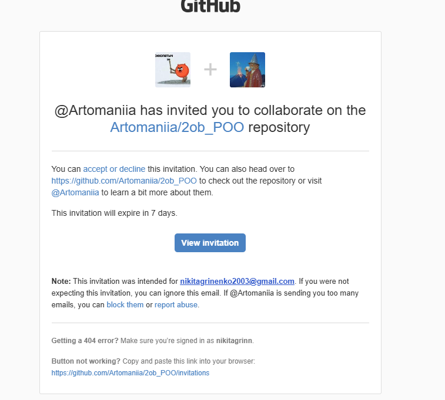

# Основные концепции ООП на Python

## Цель работы

1. Изучить основные концепции объектно-ориентированного программирования (ООП).
2. Распределить задачи внутри команды и использовать методологию ветвления **GitHub Flow**.
3. Использовать LLM (большие языковые модели) в качестве менеджера проекта для распределения задач и планирования.
4. Описать концепции ООП на языке Python в командном репозитории.

---

## 1. Ссылка на репозиторий и команда

Работа выполнялась в командном репозитории: 
**[Artomaniia/2ob_POO](https://github.com/Artomaniia/2ob_POO)**

* **Никнейм в GitHub**: `nikitagrinn`

Скриншот-подтверждение приглашения в репозиторий:

---

## 2. Организация работы в команде и GitHub Flow

В ходе выполнения работы мы использовали **GitHub Flow** — легковесную методологию ветвления.

**Процесс работы:**

1. В репозитории создаётся ветка `main` как основная стабильная ветка.
2. Каждый участник берёт на себя определённый набор концепций ООП.
3. Участник создаёт от `main` свою ветку (например, `concept/static-method`).
4. В своей ветке вносятся коммиты с описанием концепции (папка или `.md` файл).
5. По завершении работы создаётся **Pull Request (PR)** в ветку `main`.
6. Остальные участники команды делают код-ревью.
7. После успешного ревью ветка сливается в `main`.

## 3. Пример моего вклада (Пример описания концепции)

В рамках работы я описывал концепцию ООП — **«Статический метод»** и приводил практические примеры на языке Python. 

Чтобы не дублировать большой объём текста в данном портфолио, с полным теоретическим описанием, сравнением статических методов с обычными методами класса и примерами кода можно ознакомиться по прямым ссылкам в нашем командном репозитории:

* 📄 **[Теоретическое описание концепции (Markdown)](https://github.com/Artomaniia/2ob_POO/blob/concept/static-method/static_method/static_method.md)**
* 💻 **[Примеры кода](https://github.com/Artomaniia/2ob_POO/tree/concept/static-method/static_method/examples)**

---

## Итоговый результат

Итоговое описание концепций, собранное всей командой, доступно в главном `README.md` нашего командного репозитория:
**[https://github.com/Artomaniia/2ob_POO](https://github.com/Artomaniia/2ob_POO)**
